# Relatório Técnico — Previsão de Churn de Clientes (Telecom)

Documentação completa do processo de análise e modelagem, etapa por etapa, seguindo a
metodologia CRISP-DM: entendimento dos dados, preparação, modelagem (Regressão Logística e
Random Forest) e tuning de hiperparâmetros.

Base de dados: [Telco Customer Churn](https://www.kaggle.com/datasets/blastchar/telco-customer-churn) — 7.043 clientes, 21 colunas.

---

## Sumário

- [Relatório Técnico — Previsão de Churn de Clientes (Telecom)](#relatório-técnico--previsão-de-churn-de-clientes-telecom)
  - [Sumário](#sumário)
  - [Etapa 01 — Análise Exploratória dos Dados](#etapa-01--análise-exploratória-dos-dados)
    - [Estrutura geral](#estrutura-geral)
    - [Balanceamento da variável alvo](#balanceamento-da-variável-alvo)
    - [Churn por perfil de cliente](#churn-por-perfil-de-cliente)
    - [Relação entre variáveis numéricas](#relação-entre-variáveis-numéricas)
  - [Etapa 02 — Tratamento dos Dados](#etapa-02--tratamento-dos-dados)
    - [Corrigindo `TotalCharges`](#corrigindo-totalcharges)
    - [Padronizando o rótulo alvo](#padronizando-o-rótulo-alvo)
  - [Etapa 03 — Modelagem: Regressão Logística](#etapa-03--modelagem-regressão-logística)
    - [Pipeline de preparação para modelagem](#pipeline-de-preparação-para-modelagem)
    - [Resultado](#resultado)
  - [Etapa 04 — Modelagem: Random Forest](#etapa-04--modelagem-random-forest)
    - [Quais variáveis mais pesam na decisão do modelo?](#quais-variáveis-mais-pesam-na-decisão-do-modelo)
  - [Etapa 05 — Tuning (GridSearchCV)](#etapa-05--tuning-gridsearchcv)
  - [Comparação Final dos Modelos](#comparação-final-dos-modelos)
    - [Principais conclusões](#principais-conclusões)
    - [Próximos passos sugeridos](#próximos-passos-sugeridos)
  - [Etapa 06 — Simulação de Cenários de Retenção](#etapa-06--simulação-de-cenários-de-retenção)
    - [Limitações do método](#limitações-do-método)
  - [Próximos passos sugeridos](#próximos-passos-sugeridos-1)

---

## Etapa 01 — Análise Exploratória dos Dados

Antes de qualquer modelagem, é preciso entender a estrutura, qualidade e os padrões da base de
dados.

### Estrutura geral

| Métrica | Valor |
|---|---|
| Linhas | 7.043 |
| Colunas | 21 |
| Nulos explícitos | 0 |
| Nulos ocultos (texto em branco em `TotalCharges`) | 11 |

**Achado nº1 — dado sujo:** a coluna `TotalCharges` vem tipada como texto (`object`), não
numérica. Ao investigar, encontramos 11 registros com valor em branco (`" "`) em vez de número —
o `.isna().sum()` não detecta isso, pois tecnicamente não é um "nulo" do pandas. Esse tipo de
problema só aparece quando se olha tipo de dado + valores únicos, não apenas a contagem de nulos.

### Balanceamento da variável alvo

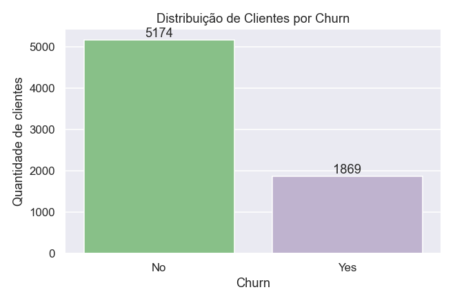

*Distribuição de clientes: 5.174 permaneceram ativos, 1.869 cancelaram.*

A base é desbalanceada — **73,5%** não cancelaram e **26,5%** cancelaram. Um modelo "preguiçoso"
que sempre previsse "não cancela" já acertaria ~73% das vezes. Por isso, acompanhamos também
*balanced accuracy*, *precision*, *recall* e *f1-score* em todos os modelos, não só acurácia.

### Churn por perfil de cliente

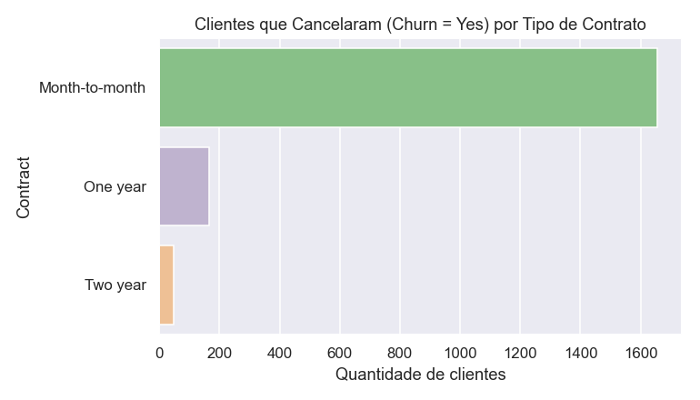

*Cancelamentos por tipo de contrato.*

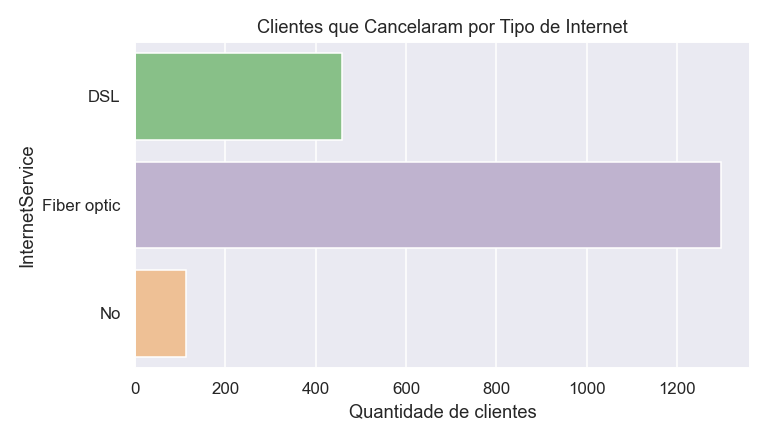

*Cancelamentos por tipo de internet.*

**Insight mais forte da base:** dos 1.869 clientes que cancelaram, **1.655 (88,6%)** estavam em
contratos `Month-to-month` (mensal, sem fidelidade). Contratos anuais e bianuais praticamente não
têm churn (166 e 48 casos). Clientes com internet **Fibra Óptica** também cancelam
desproporcionalmente mais (1.297 de 1.869, ~69%) do que DSL ou sem internet — possível sinal de
problema de preço ou qualidade percebida nesse plano.

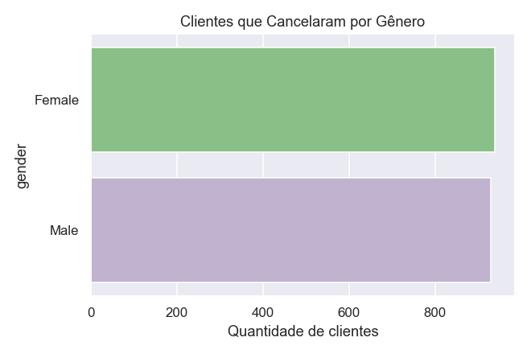

*Cancelamentos por gênero (quase idêntico: 939 vs 930) — gênero não parece relevante para prever
churn.*

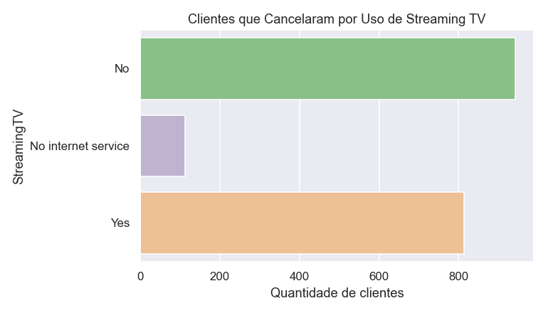

*Cancelamentos por uso de Streaming TV.*

### Relação entre variáveis numéricas

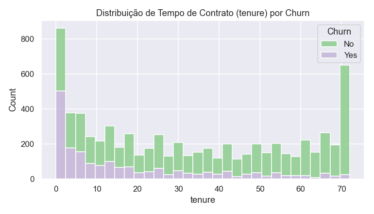

*Tempo de contrato (tenure) por churn: cancelamentos concentrados nos primeiros meses.*

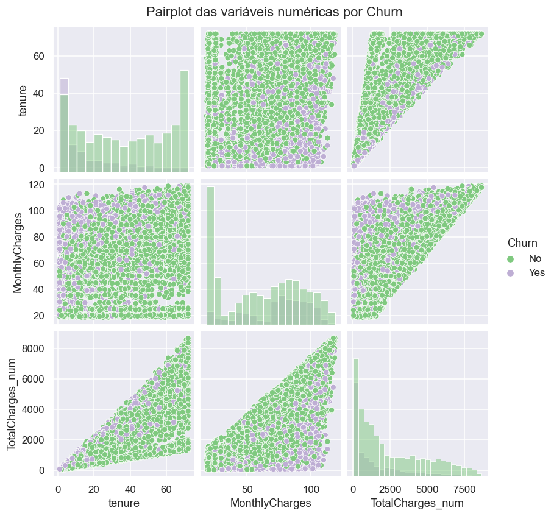

*Relação entre tenure, mensalidade e total pago, por churn.*

O cancelamento se concentra fortemente em clientes com **pouco tempo de casa** — coerente com o
padrão de contratos mensais. Mensalidades mais altas também parecem puxar mais churn, sugerindo
sensibilidade a preço.

---

## Etapa 02 — Tratamento dos Dados

Com os problemas mapeados na exploração, corrigimos a base antes de qualquer treino de modelo.

### Corrigindo `TotalCharges`

```python
# substitui strings em branco por NaN e converte para número
df['TotalCharges'] = df['TotalCharges'].replace(' ', np.nan)
df['TotalCharges'] = pd.to_numeric(df['TotalCharges'])
```

Investigando os 11 registros problemáticos, todos tinham `tenure = 0` — são clientes
recém-cadastrados que ainda não completaram um ciclo de cobrança. Faz sentido preencher com `0`
em vez de descartar as linhas (o que jogaria fora informação de outras 20 colunas).

```python
df['TotalCharges'] = df['TotalCharges'].fillna(0)
```

### Padronizando o rótulo alvo

Garantimos que `Churn` esteja sempre como texto (`No`/`Yes`), independente de a fonte trazer 0/1
ou Yes/No.

---

## Etapa 03 — Modelagem: Regressão Logística

Primeiro modelo (baseline): simples, rápido de treinar e fácil de interpretar. Serve como
referência de comparação para os modelos seguintes.

### Pipeline de preparação para modelagem

1. **Separar X e y** — remover `customerID` (identificador) e `Churn` (alvo) das variáveis explicativas
2. **Codificar o alvo** — `LabelEncoder`: No → 0, Yes → 1
3. **One-hot encoding** — `pd.get_dummies` transforma as 16 colunas categóricas em variáveis binárias (X passa de 19 para 45 colunas)
4. **Normalização** — `MinMaxScaler` coloca todas as variáveis na escala 0–1
5. **Split treino/teste** — 75% treino / 25% teste, com `stratify=y` para manter a proporção de churn nos dois conjuntos

### Resultado


*Matriz de confusão (conjunto de teste, n=1.761).*

| Métrica | Valor |
|---|---|
| Acurácia (teste) | 80,1% |
| Acurácia balanceada | 71,8% |
| Precision | 64,9% |
| Recall | 54,2% |
| F1-score | 59,0% |
| Acurácia (treino) | 80,6% (próxima da de teste — bom sinal de generalização) |

**Leitura:** o modelo acerta ~80% dos casos, mas o **recall de 54%** mostra que quase metade dos
clientes que realmente cancelam não é identificada pelo modelo (falsos negativos) — o erro mais
caro do ponto de vista de negócio, já que é justamente esse cliente que a equipe de retenção
precisaria contatar.

---

## Etapa 04 — Modelagem: Random Forest

Modelo de ensemble (várias árvores de decisão combinadas), com potencial de capturar relações
não-lineares que a Regressão Logística não enxerga.


*Matriz de confusão (conjunto de teste), parâmetros padrão.*

| Métrica | Valor |
|---|---|
| Acurácia (teste) | 78,1% |
| Acurácia balanceada | 68,0% |
| Precision | 61,7% |
| Recall | 46,5% |

**Overfitting detectado:** a acurácia no **treino chega a 99,8%**, enquanto no **teste cai para
78,1%** — um gap de ~22 pontos percentuais. O modelo "decorou" o conjunto de treino em vez de
aprender um padrão que generaliza. Isso é esperado em Random Forests sem limite de profundidade
das árvores, e é exatamente o problema que atacamos na próxima etapa.

### Quais variáveis mais pesam na decisão do modelo?

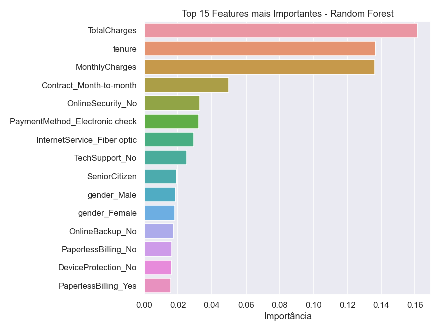

*Top 15 variáveis mais importantes segundo o Random Forest.*

`tenure`, `TotalCharges` e `MonthlyCharges` (as três variáveis numéricas) dominam a importância,
seguidas pelo tipo de contrato mensal — confirmando exatamente os padrões observados na análise
exploratória.

---

## Etapa 05 — Tuning (GridSearchCV)

Para reduzir o overfitting do Random Forest, buscamos a melhor combinação de hiperparâmetros
usando validação cruzada de 5 folds.

```python
parameters = {
    'max_depth': [3, 5, 7, 9, 10],
    'n_estimators': [100, 300, 500]
}
grid_search = GridSearchCV(rf, parameters, scoring='accuracy', cv=5, n_jobs=-1)
grid_search.fit(X_train, y_train)

# melhores hiperparâmetros encontrados:
# max_depth: 9
# n_estimators: 100
# acurácia média (CV): 80,46%
```

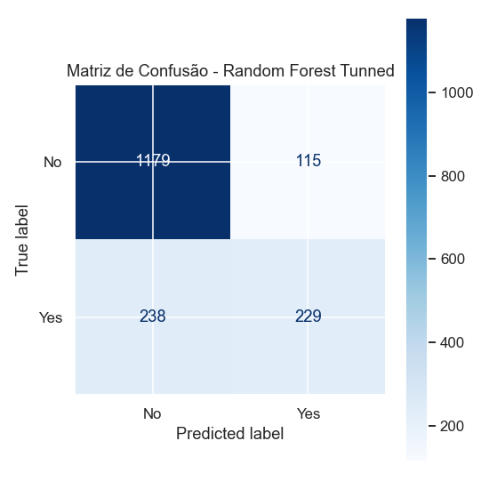

*Matriz de confusão (conjunto de teste), modelo ajustado.*

| Métrica | Valor |
|---|---|
| Acurácia (teste) | 80,0% |
| Acurácia balanceada | 70,1% |
| Precision | 66,6% |
| Recall | 49,0% |
| Acurácia (treino) | 85,3% |

**Resultado do tuning:** limitar `max_depth` a 9 reduziu o gap treino-teste de ~22 p.p. para
apenas **~5 p.p.**, controlando bem o overfitting — mesmo que a acurácia absoluta de teste tenha
ficado próxima da versão sem tuning. O ganho real aqui é um modelo mais confiável para generalizar
em dados novos.

---

## Comparação Final dos Modelos

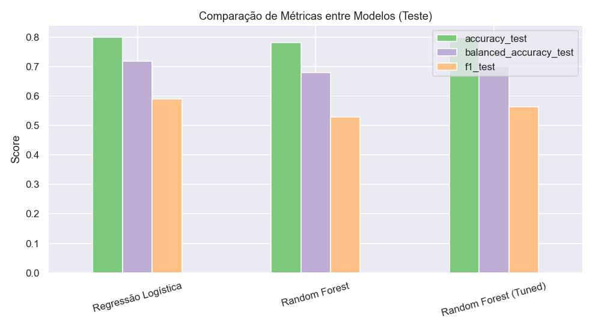

*Acurácia, acurácia balanceada e F1-score por modelo.*

| Modelo | Acc. treino | Acc. teste | Acc. balanceada | Precision | Recall | F1-score |
|---|---|---|---|---|---|---|
| Regressão Logística | 80,63% | 80,07% | 71,79% | 64,87% | 54,18% | 59,04% |
| Random Forest | 99,79% | 78,14% | 68,02% | 61,65% | 46,47% | 52,99% |
| **Random Forest (Tuned)** | 85,31% | 79,95% | 70,07% | 66,57% | 49,04% | 56,47% |

**Conclusão prática:** a **Regressão Logística**, mesmo sendo o modelo mais simples, teve
desempenho de teste equivalente (ou melhor) ao Random Forest com tuning — e sem sinais de
overfitting "de fábrica". O Random Forest só se tornou competitivo depois de ajustado, e ainda
assim não superou o baseline. Isso reforça uma lição comum em ciência de dados: *modelo mais
complexo não é sinônimo de modelo melhor* — vale sempre comparar contra um baseline simples.

### Principais conclusões

- O churn está fortemente concentrado em clientes com **contrato mensal**, **pouco tempo de casa**
  e **internet fibra óptica**.
- A base é desbalanceada (26,5% de churn) — acurácia isolada não é suficiente para avaliar os
  modelos.
- O Random Forest sem tuning sofre overfitting severo; o GridSearchCV ajuda a controlar isso.
- Para o objetivo de negócio (reter clientes), o **recall** é tão importante quanto a acurácia —
  todos os modelos ainda deixam passar entre 46% e 54% dos clientes que de fato cancelam.

### Próximos passos sugeridos

- Testar balanceamento de classes (`class_weight='balanced'`, SMOTE) para melhorar o recall.
- Testar modelos de gradient boosting (XGBoost, LightGBM).
- Ajustar o threshold de decisão priorizando recall sobre precisão.
- Avaliar o modelo com métricas de negócio (custo de reter vs. custo de perder um cliente).


---

## Etapa 06 — Simulação de Cenários de Retenção

Com o modelo treinado, é possível ir além da previsão e simular o **impacto de ações de
retenção** antes de investir nelas: alteramos artificialmente um atributo do cadastro de um
cliente ativo (ex.: tipo de contrato) e recalculamos a probabilidade de churn prevista pelo
modelo, mantendo todas as demais variáveis constantes.

```python
# exemplo: migrar clientes de contrato mensal para anual
elegiveis = df_ativos['Contract'] == 'Month-to-month'
df_simulado = df_ativos.copy()
df_simulado.loc[elegiveis, 'Contract'] = 'One year'

# recalcula a probabilidade de churn com o modelo já treinado
novas_probas = modelo.predict_proba(preparar_features(df_simulado))[:, 1]
```

A taxa de churn "esperada" da base ativa é a média das probabilidades previstas pelo modelo
(16,75% na configuração atual). Comparamos essa taxa antes e depois de cada simulação:

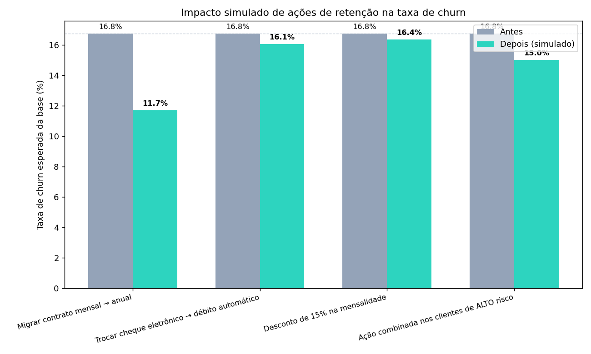

*Comparação da taxa de churn esperada da base ativa, antes e depois de cada cenário simulado.*

| Cenário | Clientes afetados | Taxa antes | Taxa depois | Redução |
|---|---|---|---|---|
| Migrar contrato mensal → anual | 2.220 | 16,75% | 11,71% | −5,04 p.p. |
| Trocar cheque eletrônico → débito automático | 1.294 | 16,75% | 16,05% | −0,70 p.p. |
| Desconto de 15% na mensalidade (fibra óptica) | 1.799 | 16,75% | 16,35% | −0,41 p.p. |
| Ação combinada nos clientes de alto risco | 359 | 16,75% | 15,01% | −1,75 p.p. |

**Migrar contrato mensal para anual** é a ação de maior impacto estimado entre as testadas —
mesmo comparada a uma ação combinada (contrato + pagamento) aplicada especificamente aos clientes
de maior risco.

### Limitações do método

Esta é uma simulação estatística baseada nas correlações que o modelo aprendeu dos dados
históricos, não um experimento causal controlado. Ela responde: *"clientes com este outro perfil
tendem a cancelar menos, segundo o padrão observado na base"* — o que é uma evidência útil para
priorizar ações, mas não uma prova definitiva de causalidade. A validação real requer um teste A/B
com um grupo piloto de clientes, medindo o resultado de fato após a ação ser aplicada.

Script utilizado: `src/simular_reducao_churn.py`

---

## Próximos passos sugeridos

- Testar balanceamento de classes (`class_weight='balanced'`, SMOTE) para melhorar o recall.
- Testar modelos de gradient boosting (XGBoost, LightGBM).
- Ajustar o threshold de decisão priorizando recall sobre precisão.
- Avaliar o modelo com métricas de negócio (custo de reter vs. custo de perder um cliente).
